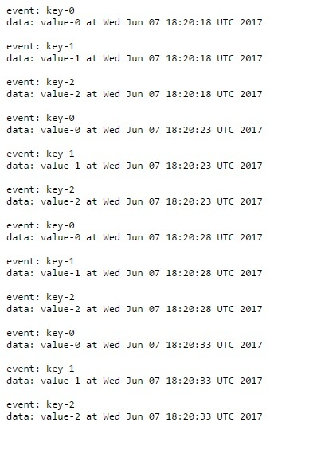

## To run....

- `git clone https://github.com/abhirockzz/jaxrs-sse.git` 
- `docker build -t abhirockzz/gf5-b-8 -f Dockerfile_gf5 .`
- `docker build -t abhirockzz/gf5-b-8-jaxrs-example -f Dockerfile_app .`
- `docker run --rm -t -p 8080:8080 -p 4848:4848 -p 8181:8181 abhirockzz/gf5-b-8-jaxrs-example`
- what's the Docker host IP ? `docker-machine ip` (e.g. 192.168.99.100)
- `http://<docker_ip>:8080/jaxrs-sse/events/subscribe`. You should see a continuous stream of (SSE) events

